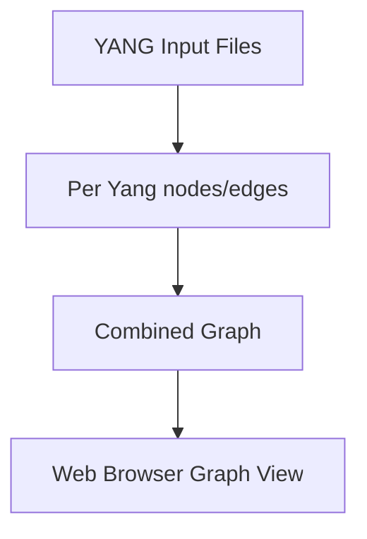

# yang-graph

Generate a graph of relationships between YANG module objects and lists. A schema type view of the YANG modules.

## Overview

The `yang-graph` project processes YANG files to generate a graph that defines possible nodes and edges that can be connected from other YANG modules. This tool is designed to capture relationships across multiple YANG files, focusing on configuration properties and their interdependencies.

Existing tools like Yangster can generate graphs for single YANG files, but `yang-graph` extends this capability to multiple YANG files, focusing on the relationships between them rather than the actual data types.



## Goals

* **Config Properties**: Only concerned with configuration (`config true`) properties.
* **Cross-Module Relationships**: Capture edge relationships between:
  * List keys and leafrefs in other YANG modules.
  * Leafrefs and leafrefs in other YANG modules.
  * Leafrefs and list keys in other YANG modules.

## Stages

There are 2 stages to the final generation:
1. **Stage 1**: Converts the YANG files into a format that can be used by the graphing tool.
2. **Stage 2**: Generates the graph from the converted files. The graph file for each YANG contains the list of nodes and edges that can be connected to other YANG modules.

The final stage is rendering the graph. This is done with Cytoscape.js. The graph is rendered in a web browser.

## Installation

### Python Requirements

Ensure you have Python 3 installed. Install the required Python packages:

```bash
pip install pyang
```

### Node.js Requirements

Ensure you have Node.js and npm installed. Install the necessary npm dependencies:

```bash
npm install
```

## Usage

### Generate Graphs

To perform stage 1 and 2, run:

```bash
./generate_graph.sh
```

### Start the Web Server

To start the web server and render the graph, run:

```bash
npm start
```

## License

This project is licensed under the Apache License 2.0. See the [LICENSE](./LICENSE) file for details.

## Acknowledgements

This project uses the following open-source projects:

* [pyang](https://github.com/mbj4668/pyang)
* [Cytoscape.js](https://js.cytoscape.org/)

## Contact

For any questions or suggestions, please open an issue or contact the project maintainers.
